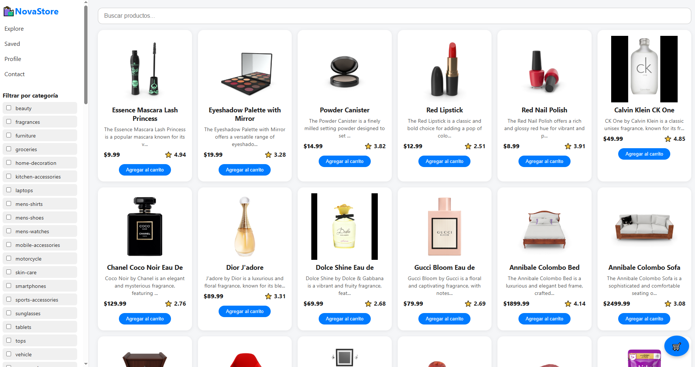

# 🛍️ NovaStore

NovaStore es una aplicación web de tipo marketplace que permite visualizar y filtrar productos de diferentes categorías, incluyendo tecnología, alimentos, motos y más. El proyecto fue desarrollado usando HTML, CSS y JavaScript, integrando una API externa y utilizando LocalStorage para simular un carrito de compras persistente.

---




## 🔧 Funcionalidades

- 🔎 Búsqueda de productos por nombre
- 🏷️ Filtro por categoría y marca
- 📱 Diseño responsivo adaptable a móvil y escritorio
- 🛒 Carrito de compras con almacenamiento en LocalStorage
- 🎨 Interfaz amigable y moderna
- 📦 Consumo de API pública (DummyJSON)
---

## 🧩 Tecnologías usadas
- HTML5
- CSS
- JavaScript 
- LocalStorage
- API REST (DummyJSON)


## 📦 API utilizada

- [DummyJSON - products](https://dummyjson.com/products)

Se usó la API pública de DummyJSON, que provee datos de productos variados como teléfonos, laptops, alimentos, ropa, entre otros.

---

## 🚀 Cómo ejecutar el proyecto

1. Clona este repositorio o descarga el ZIP:
   ```bash
   git clone https://github.com/tu-usuario/nextphone.git

## 📁 Estructura del proyecto

nextphone/
├── index.html       # Estructura HTML principal
├── style.css        # Estilos personalizados
├── script.js        # Lógica JS y consumo de API
└── README.md        # Documentación del proyecto
└── screenshot.png 

## 🛠️ Funcionalidades técnicas destacadas
- Uso de fetch() para consumir productos desde una API pública.
- Renderizado dinámico de tarjetas de productos.
- Filtros por categorías y marcas extraídas automáticamente.
- Buscador por coincidencia de nombre.
- Agregar productos al carrito.
- Visualización del carrito como panel lateral.
- Persistencia del carrito con localStorage.


## ✍️ Autor

    Víctor Alejandro
    [Campuslands 2025]